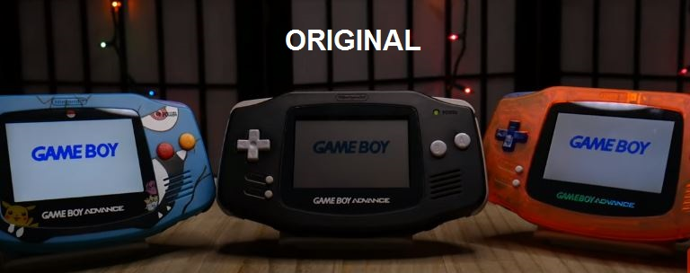
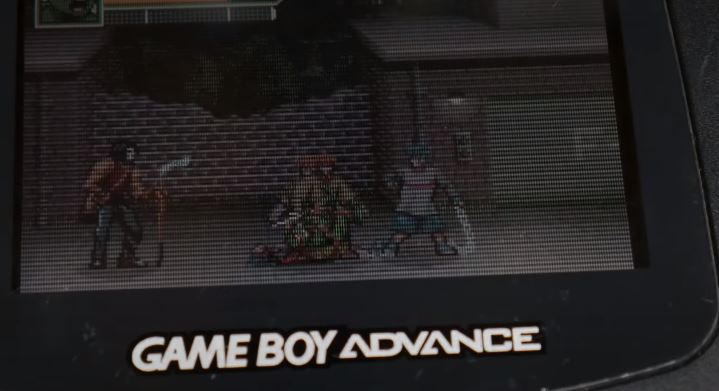
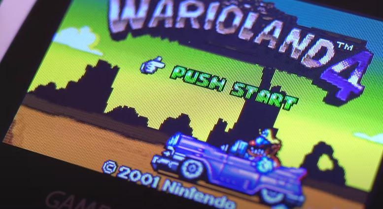
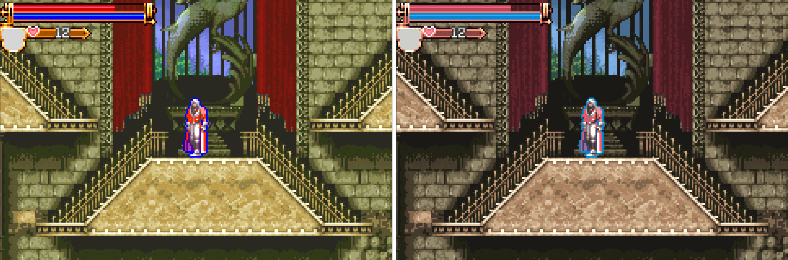
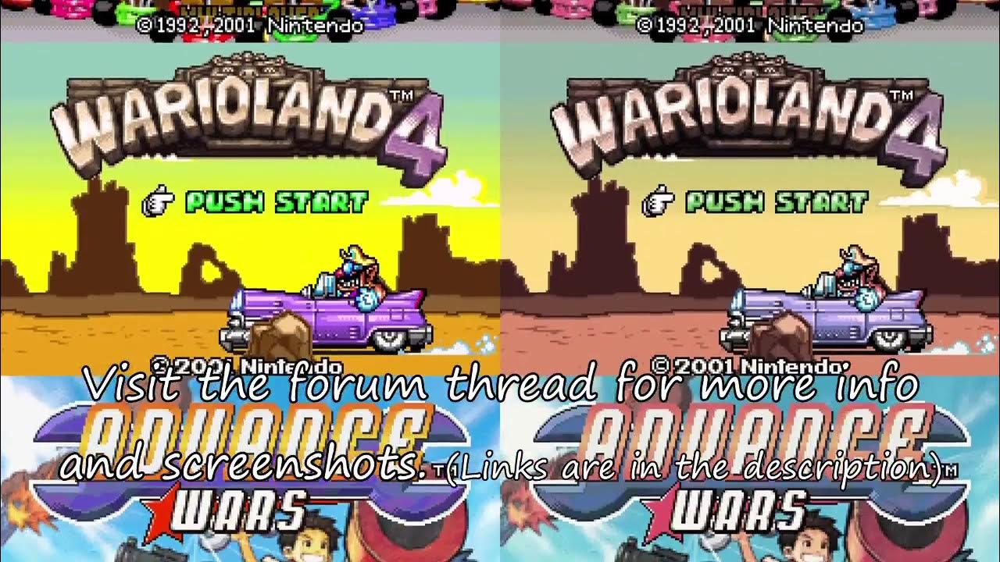
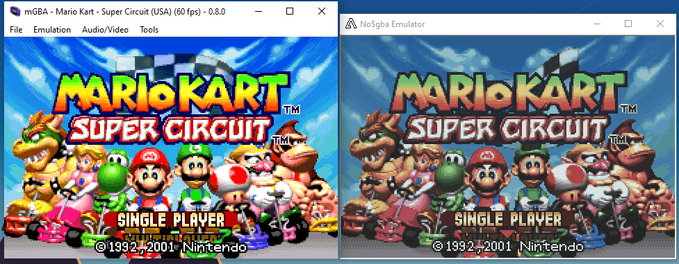
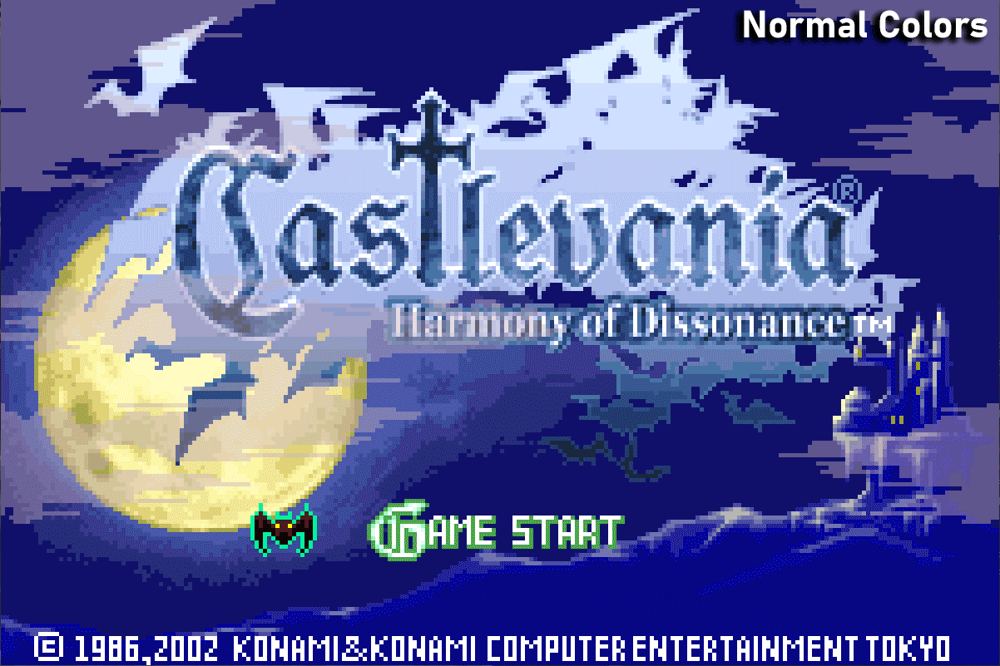

GBA:

A tela do GBA é bem diferente do que as pessoas estão acostumadas com a saída do Emulador:
















Dunno where to post this, and since this is my first time posting here, I just wanna make this real quick.

Do you like both Pokefan531's and hunterk's GBA Colors shader and Dominus Iniquitatis' LCD shader, and wish there was a way to combine the two together? Well, it's simple my friends:

1. Go to the shaders folder in the mGBA folder and make a new folder there

2. Rename it as "gba-lcd-combo.shader"

3. Copy both gba-color.fs and lcd.fs from their respective folder, then paste them on your new folder

4. Create a new text file and change "New Text Document.txt" to "manifest.ini" (assuming that you've uncheck the "hide extensions" option in the "Folders and search options"

5. Copy this text to the file:

```
Code:
[shader]
name=GBA Color/LCD Combo
author=Pokefan531 & hunterk (GBA Color), and Dominus Iniquitatis (LCD)
description=Merged by a really creative idiot
passes=2

[pass.0]
fragmentShader=lcd.fs
blend=1
width=-3
height=-3

[pass.0.uniform.boundBrightness]
type=float
readableName=Bound brightness
default=0.9
min=0.0
max=1.0

[pass.1]
fragmentShader=gba-color.fs
blend=1

[pass.1.uniform.darken_screen]
type=float
default=0.5
readableName=Darken Screen
```

6. Save

Seriously, this was so easy, that even a curious simpleton like me was able to do it. I did this out of my desire to combine the two shaders together.


Fonte: 

https://forums.mgba.io/showthread.php?tid=3346
