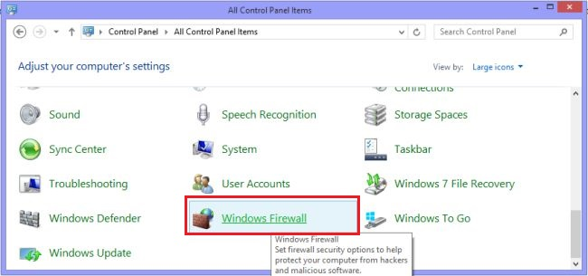
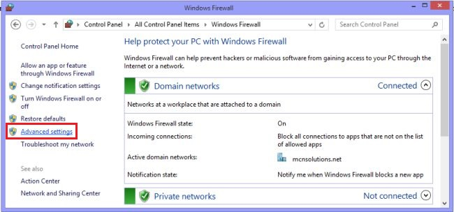
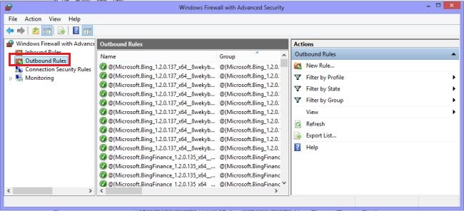
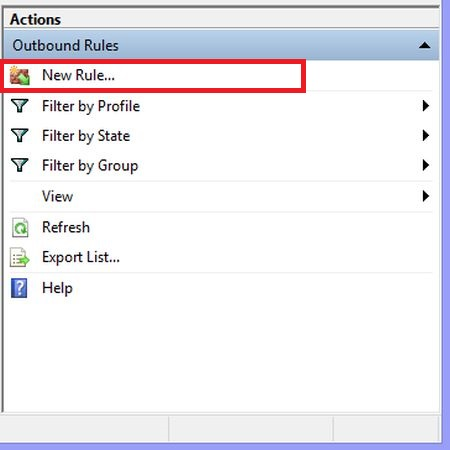
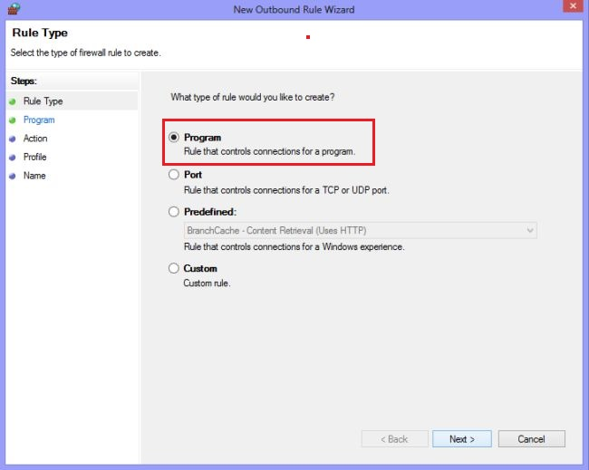
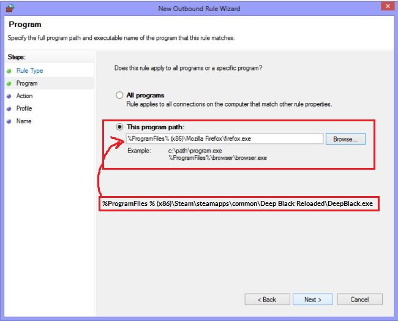
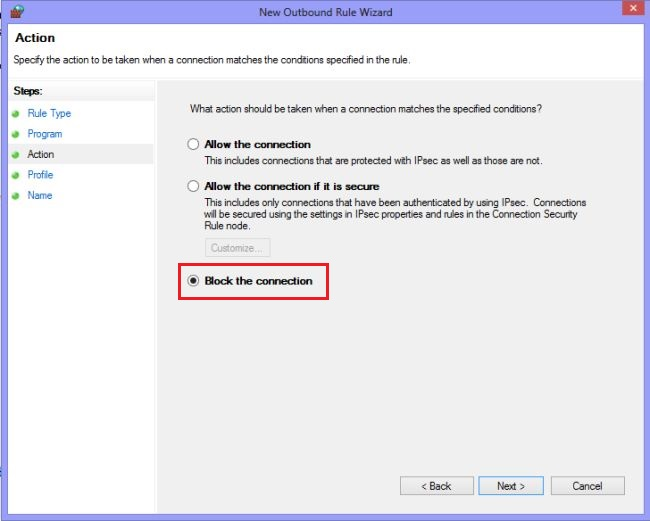

O jogo não inicia tela preta

Esse erro acontece porque o jogo verifica se existe um servidor remoto que não existe mais.

Solução: Bloquear DeepBlack.exe pelo firewall

FIX FOR Black screen or "Initialization failed.Resources corrupted or other read data error" error on launch

This error occurs because the game checks a remote server for files that no longer exist.

SOLUTION: Block DeepBlack.exe in firewall
Make a firewall rule preventing DeepBlack.exe making outbound connections.

Windows 8

Step 1
 
Go to the Control Panel and click on "Windows Firewall".

Step 2
 
In the Windows Firewall window click on "Advanced Settings".

Step 3
 
In this step click on "Outbound rules".

Step 3
 
In this step click on the new rule.

Step 4
 
In this step click on "Program" and click on "Next".

Step 5
 
Now click on "Browse" then select the program to be blocked from accessing the internet then click on "Next".

Step 6
 
Select "Block the connection" and click on "Next" and use the following procedure.

