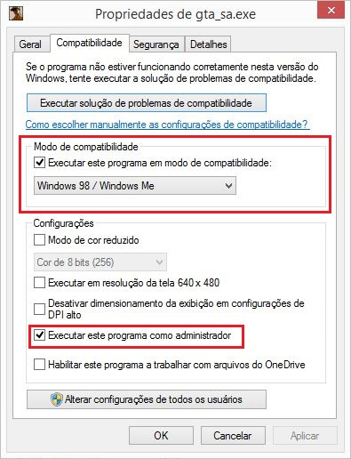

Evitar a maioria dos crashs no jogo (usuários de Windows 8.1 e 10)

<ul>
<li>
No executável do jogo selecione executar este programa como administrador e coloque em modo de compatibilidade para WindowsME/98 (isso irá deletar os SAVES)

    
    </li>

<li>
Use a resolução 1024 x 768

    </li>

</ul>

