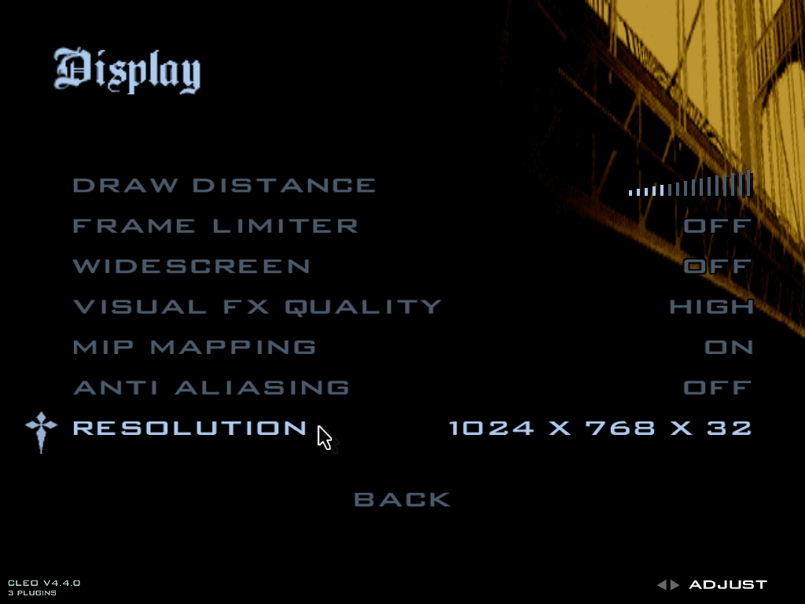

Evitar a maioria dos crashs no jogo (usuários de Windows 8.1 e 10)

<ul>
<li>
No executável do jogo selecione executar este programa como administrador e coloque em modo de compatibilidade para WindowsME/98 (isso irá deletar os SAVES)

    
    </li>

<li>
Use a resolução 1024 x 768

    </li>

</ul>

Caso você não saiba a versão de GTA SA de PC é uma versão que teve muitos cortes, censura e efeitos removidos. A versão de ps2 é tida como a versão definitiva do jogo.

Fontes: https://gtaforums.com/topic/749193-san-andreas-ps2-features-to-pc

### Contornar - Tela preta no meio da missão JUST BUSINESS (Big Smoke)

Ficar apertando o PAUSE antes e depois do caminhão explodir. Quando explodir fique mirando enquanto as motos te perseguem não atirem  e continue apertando PAUSE até as motos entrarem no túnel.

Acredito que seja por conta do pocessamento rápido atual as motos não são espownadas e o jogo trava.

Fonte: https://www.youtube.com/watch?v=QkN2z_o4acA
